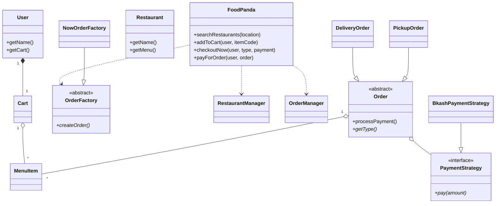

# FoodPanda LLD Simulation

A comprehensive Low-Level Design (LLD) simulation of a food delivery platform like FoodPanda, implemented in C++. This project demonstrates the application of various SOLID principles and common design patterns to build a scalable and maintainable system.

## Features

- **Restaurant Management**: Browse and search for restaurants based on location.
- **Menu Exploration**: View detailed menus for each restaurant.
- **Cart System**: Add/remove items and calculate real-time totals.
- **Flexible Ordering**: Support for "Order Now" and "Scheduled Orders".
- **Execution Modes**: Choose between "Delivery" and "Pickup" options.
- **Scalable Payments**: Pluggable payment strategies (e.g., Bkash, Credit Card).
- **Notification Services**: Automated notifications upon successful order placement.

## Design Patterns Used

- **Facade Pattern**: The `FoodPanda` class acts as a single point of entry, simplifying complex interactions between managers, models, and services.
- **Strategy Pattern**: Decouples payment logic from the `Order` class, allowing new payment methods to be added without modifying existing code.
- **Abstract Factory Pattern**: Encapsulates the creation of different order types (Immediate vs. Scheduled) using `OrderFactory`.
- **Singleton Pattern**: Ensures that `RestaurantManager` and `OrderManager` have only one instance throughout the application lifecycle.
- **Inheritance & Polymorphism**: Extensively used in `Order` (Delivery vs. Pickup) and `PaymentStrategy` hierarchies.

## Project Structure

```text
FoodPanda/
├── main.cpp                # Entry point and simulation runner
├── FoodPanda.h            # Facade orchestrator
├── models/                # Core domain entities
│   ├── User.h
│   ├── Restaurant.h
│   ├── MenuItem.h
│   ├── Cart.h
│   ├── Order.h            # Base Order class
│   ├── DeliveryOrder.h
│   └── PickupOrder.h
├── managers/              # Singleton managers for global state
│   ├── RestaurantManager.h
│   └── OrderManager.h
├── strategies/            # Behavioral patterns for payments
│   ├── PaymentStrategy.h
│   ├── BkashPaymentStrategy.h
│   └── CreditCardPaymentStrategy.h
├── factories/             # Creational patterns for orders
│   ├── OrderFactory.h
│   ├── NowOrderFactory.h
│   └── ScheduledOrderFactory.h
├── services/              # Infrastructure services
│   └── NotificationService.h
└── utils/                 # General-purpose utilities
    └── TimeUtils.h
```

## Class Diagram



## How to Run

1.  **Prerequisites**: Ensure you have a C++ compiler (like `g++`) installed.
2.  **Compilation**:
    ```bash
    g++ FoodPanda/main.cpp -o FoodPandaApp
    ```
3.  **Execution**:
    ```bash
    ./FoodPandaApp
    ```

---

*This project is built for educational purposes to demonstrate LLD concepts.*
